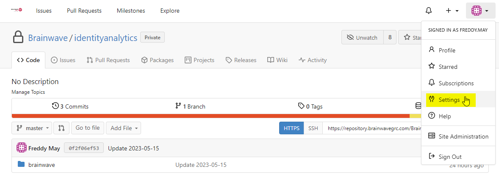
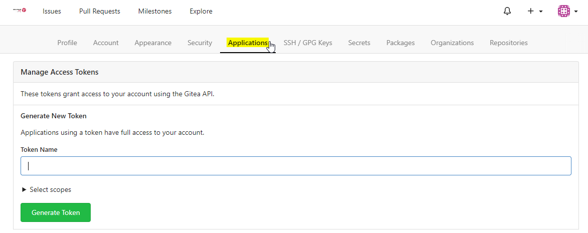
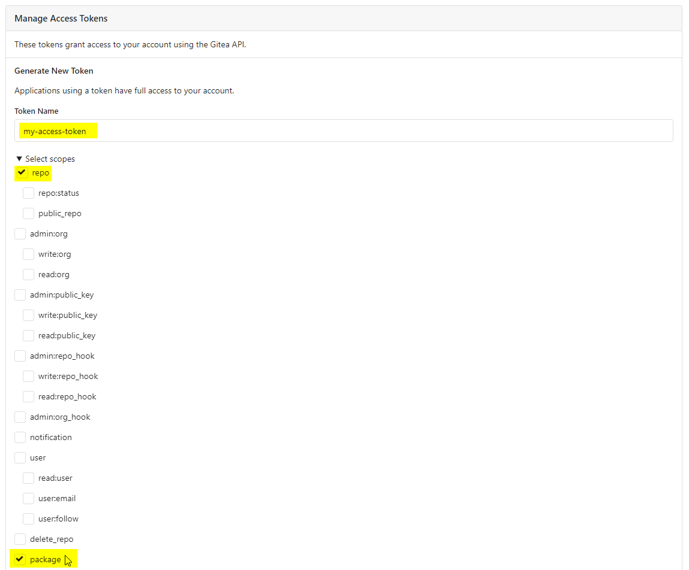

# Gitea configuration

The latest version of the Identity analytics docker images, CLI and iGRCanalytics Project are hosted on the private repository:

[https://repository.brainwavegrc.com](https://repository.brainwavegrc.com)

## Identity Analytics CLI

Please use the following links to download the desired CLI binary file (it is required to be authenticated for the following link to work):  

- [Windows version](https://repository.brainwavegrc.com/Brainwave/-/packages/generic/brainwavetools_windows_amd64/1.2)
- [Linux version](https://repository.brainwavegrc.com/Brainwave/-/packages/generic/brainwavetools_linux_amd64/1.2)

## Identity Analytics Project

The default Identity Analytics project is available at the following URL:  

[https://repository.brainwavegrc.com/Brainwave/identityanalytics](https://repository.brainwavegrc.com/Brainwave/identityanalytics)

> Note that you will get a dedicated URL for your project (for clients/partners)  

## Identity Analytics Docker Registry

You can login using:  

```sh  
docker login repository.brainwavegrc.com
```

Your credentials are required to finalize the login procedure.  

## Generating the Credentials

To get the credentials that you can use to authenticate to the docker registry and to the git repository, you can go to the Settings of your account:



Once in the settings, you will see the username in the profile tab:


For the password, you should create a token be selecting the Applications tab:  



Provide a name for your token , and select in the scope section: *repo* and *package*  



Click on Generate Token and copy the generated value. You will only be able to get this value once, so keep a copy in a safe vault.  

You will use the value of this token as a password for the docker login and git configuration.  

## External links

For more information on the use and the configuration of Gitea please refer to the official documentation:

[https://docs.gitea.com/](https://docs.gitea.com/)
