# Azure connector configuration

This documentation describes how to use scripts provided by Identity Analytics to extract the objects (groups, accounts ...) from Azure Active Directory environments. The provided script `azureadmain.py` has been designed to simplify the data extraction to obtain the importfiles required for the Identity Analytics AD Azure add-on.

The script allows to extract the objects managed in Azure Active Directory such as users, groups, groups members and groups owners.  

The extraction script is stored in `bwconnectors/azureadmain.py`

## Azure configuration

To allow the extraction of data the registration of an application is necessary in Azure. We recommend the creation of a dedicated application for the Identity Analytics service.

You will need to store  

* The application (client) Id
* The client secret
* The azure tenant Id

To create the application registration please follow these steps.  

### Application creation

1. Connect to your Azure Active Directory admin center and navigate to the "All services" page
2. Click on "Azure Active Directory"  
  
3. Navigate to the "App registrations" tab 
4. click "New registration" to register a new application  
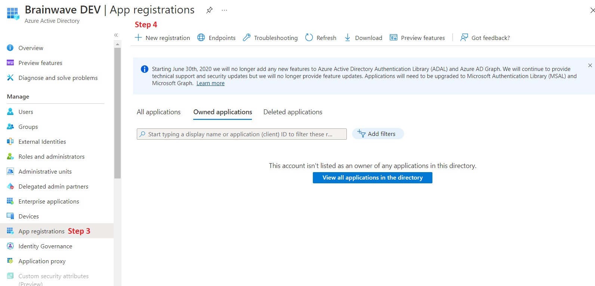  
5. Enter the desired name for your application, for example "AD Azure Data Extraction"
6. Select the type of accounts that can access the application. We recommend using the single tenant option: "Accounts in the organizational directory only"  
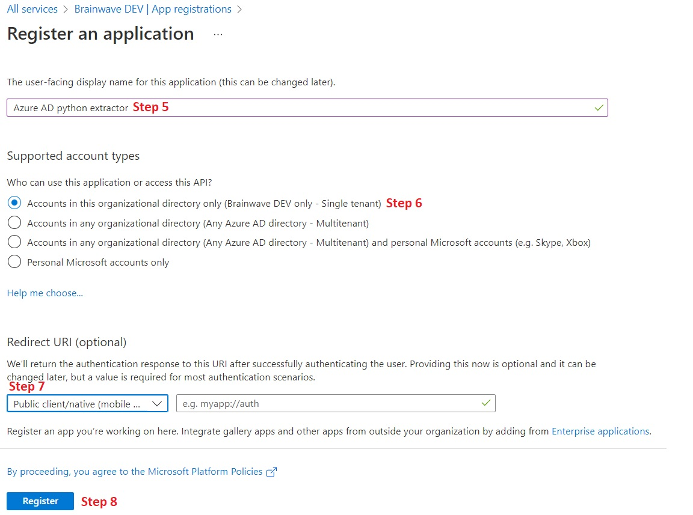  
7. In Redirect URI select the "Public client (mobile & desktop)" option in the dedicated combo
8. Finally click on "Register"  
9. Once the application is created copy and store the "Application (client) ID". This parameter will be used in the Identity Analytics service to configure the extractor  
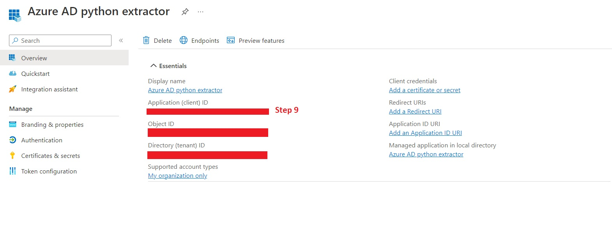  

### Application permission configuration

10. Withtin the newly created app, navigate to the "API permissions" menu  
11. click on "Add a permission"  
12. Select the "Microsoft Graph" API  
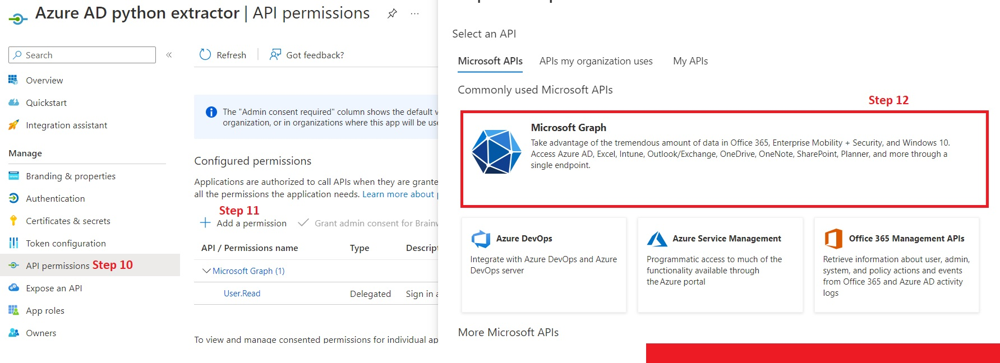  
13. Click on "Application permissions"  
14. Search and check "Directory.Read.All"  
  
15. Search and check "Member.Read.hidden"  
  
16. Add the selected permissions  
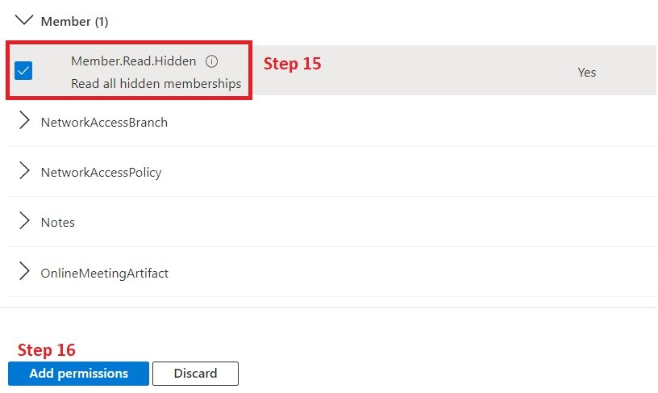  
17. Using an admin account grant consent fo the requested permissions
18. Confirm the grant  
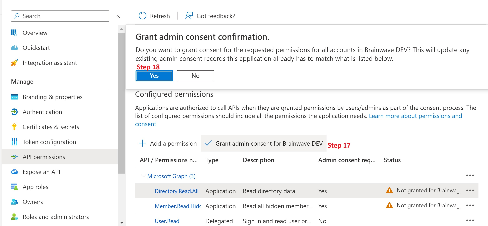  

Once consents done, you should have the following status:  
  

### Application Certificates & secrets

19. In the application page now Click on "Certificates & secrets"
20. Add a "New client secrets"
21. Provide a description for the client secret and select the desired expiration date
22. click on "Add".  
  

> [!warning] Remember to immediately copy the value of the generated secret and store it in your password management application as it is only displayed once.  
  

## Portal configuration

### Configure the connector

1. Open The 'Datasource Management -> configuration' Menu
2. Click on Add  
  
3. Select Azure Active Directory
4. Click on next  
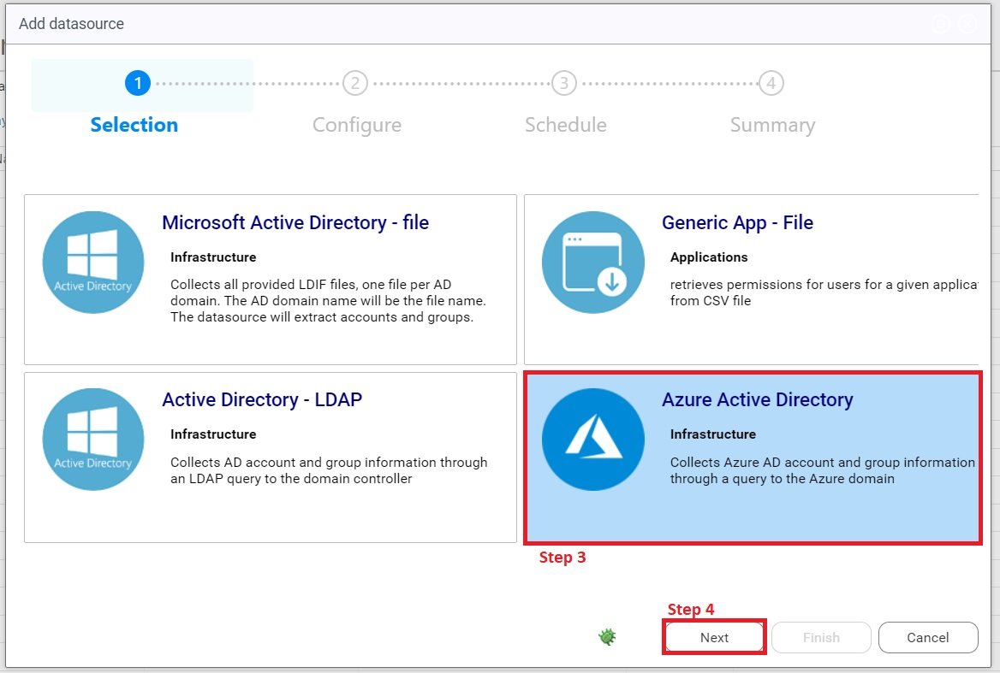  
5. Fill the field with the right informations and click on next
  - The datasource name should not contain any space.
  - The application id and tenant id correspond to the one we created earlier.
  - The client secret si the one you created earlier in the azure application. If you did not kept it, you can just recreate one.  
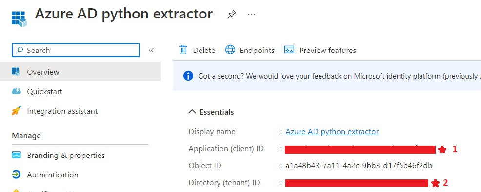  
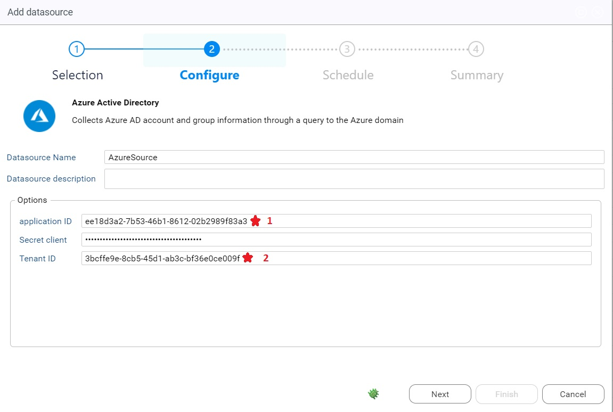  
6. Select the frequency you want for your azure data to be collected  
7. Click next  
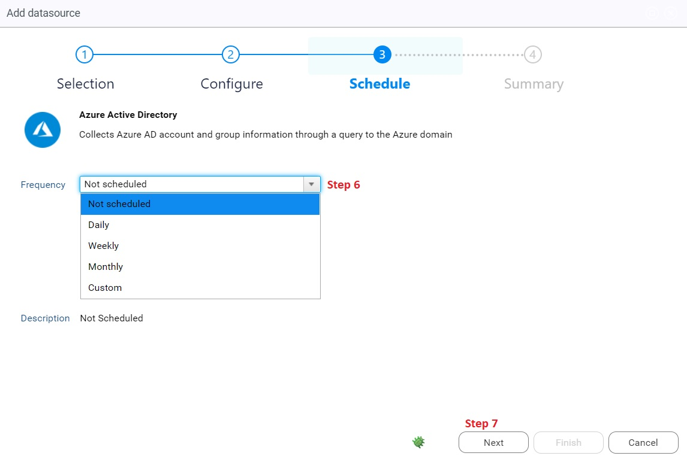  
8. Click on finish  
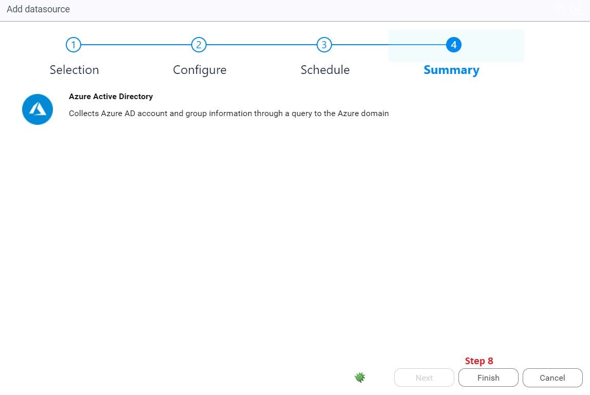  
9. Additionally, if you want to double check or modify your connector parameters, you can edit it like this  

### Extractor validation

Using the controller you can test the configuration of your extractor by performing a test extraction.  

Please refer to the controller documentation [here](/containers/controller) for more information.  

The execution of the Azure Active Directory script generates 4 `csv` files. These files are:  

* `domainName_users.csv`
* `domainName_groups.csv`
* `domainName_groups_members.csv`
* `domainName_groups_owners.csv`
